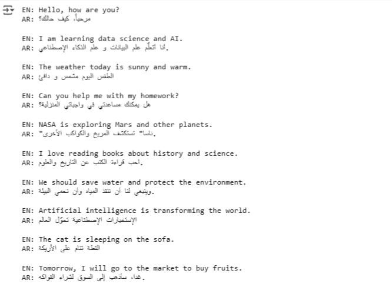

# English → Arabic Translation Module

This module provides a complete workflow to translate English text to Arabic using Hugging Face Transformers.

---

## Components

### 1. TranslationDataset
- Loads datasets from TSV files or Hugging Face datasets.
- Preprocesses data to convert English and Arabic sentences into token IDs compatible with MarianMT models.
- Ensures all text inputs are formatted as strings for compatibility.

### 2. TranslationModel
- Wraps the MarianMT model and tokenizer for English → Arabic translation.
- Methods include:
  - **Training/fine-tuning** on your dataset using Hugging Face Trainer API.
  - **Inference**: translating new English sentences to Arabic.

### 3. Workflow
1. Load your dataset using `TranslationDataset`.
2. Preprocess the data for the MarianMT model.
3. Initialize `TranslationModel` with a pretrained MarianMT checkpoint.
4. (Optional) Fine-tune the model on your dataset.
5. Translate new sentences with the `translate()` method.

### 4. Testing
- Provide example sentences to evaluate translation quality.
- Covers general, technical, and everyday language.

---

## Key Notes

- Compatible with **Transformers v5** using `text_target` for label encoding.
- Supports both **pretrained usage** and **custom fine-tuning**.
- Modular and easy to extend for other languages or datasets.

---

## Example Sentences for Testing

- "Hello, how are you?"  
- "I am learning data science and AI."  
- "The weather today is sunny and warm."  
- "Can you help me with my homework?"  
- "NASA is exploring Mars and other planets."  

[Notebook](https://colab.research.google.com/drive/1Cc6ioAaBrGVK_r8X2A2um4GfnmRJbyt2?usp=sharing)
