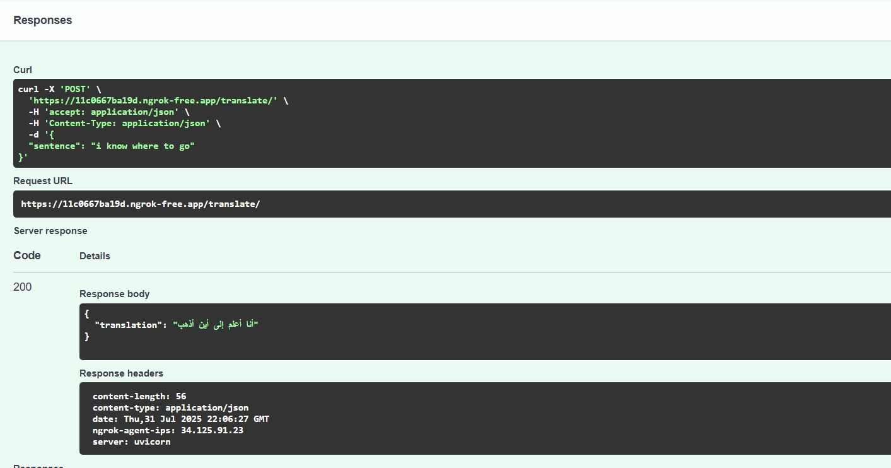
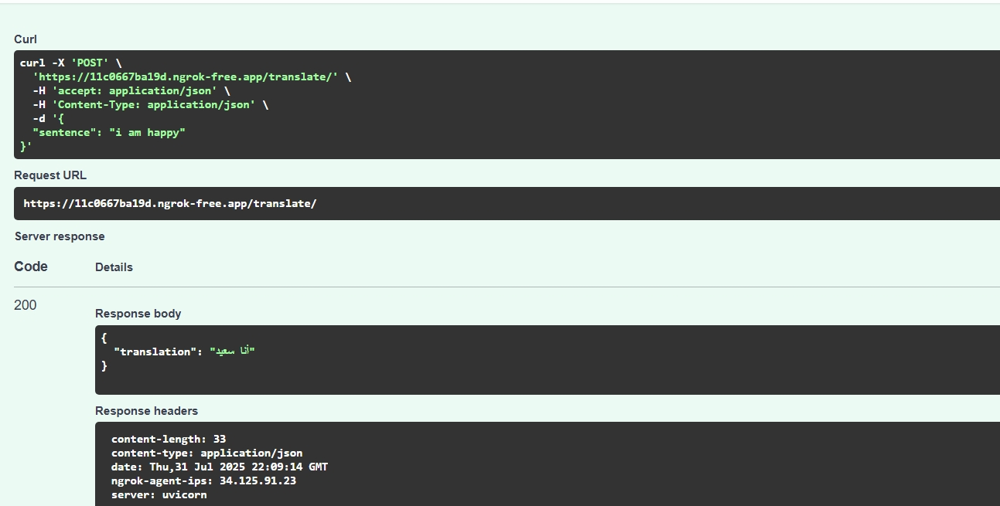
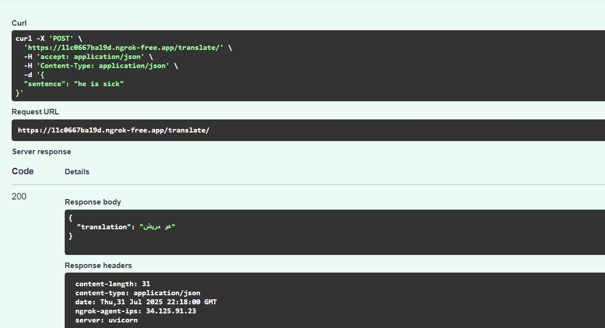

# English to Arabic Translation using Seq2Seq (FastAPI + PyTorch)

This project is a simple English to Arabic sentence translator built using a Sequence-to-Sequence (Seq2Seq) model with PyTorch. It provides a FastAPI backend and can be deployed easily via ngrok in Google Colab or locally.

---

## Features

- Trained Seq2Seq translation model (English → Arabic)
- Custom vocabulary class with serialization
- Inference API using FastAPI

---

## Run project

To run the project, first make sure Python and the required libraries are installed. The key dependencies are PyTorch, FastAPI, Uvicorn, Pydantic, and optionally `pyngrok` if you intend to run the app in a Google Colab environment. You can install them using pip:

```bash
pip install torch fastapi uvicorn pydantic pyngrok nest_asyncio

```

Next, ensure you have the model files prepared. These include the saved model weights (model_weights.pth) and the serialized vocabulary files (vocab_eng.pkl and vocab_ara.pkl). These files should be placed in a folder named translation_pt.
 
If you prefer to run the application in a Colab notebook, you can set up a public tunnel using ngrok. you can play around it on my notebook on colab [here](https://colab.research.google.com/drive/1Z7alQmTHGNw-qSNLLeEUELLSCOSrpACN?usp=sharing)

For further reading on the concepts used in this project:

- [Neural Machine Translation by Jointly Learning to Align and Translate](https://arxiv.org/abs/1409.0473) by Bahdanau et al.
- [Sequence to Sequence Learning with Neural Networks](https://arxiv.org/abs/1409.3215) by Sutskever et al.
- [Effective Approaches to Attention-based Neural Machine Translation](https://arxiv.org/abs/1508.04025) by Luong et al.


# Test results

#### test1


#### test2


#### test3
